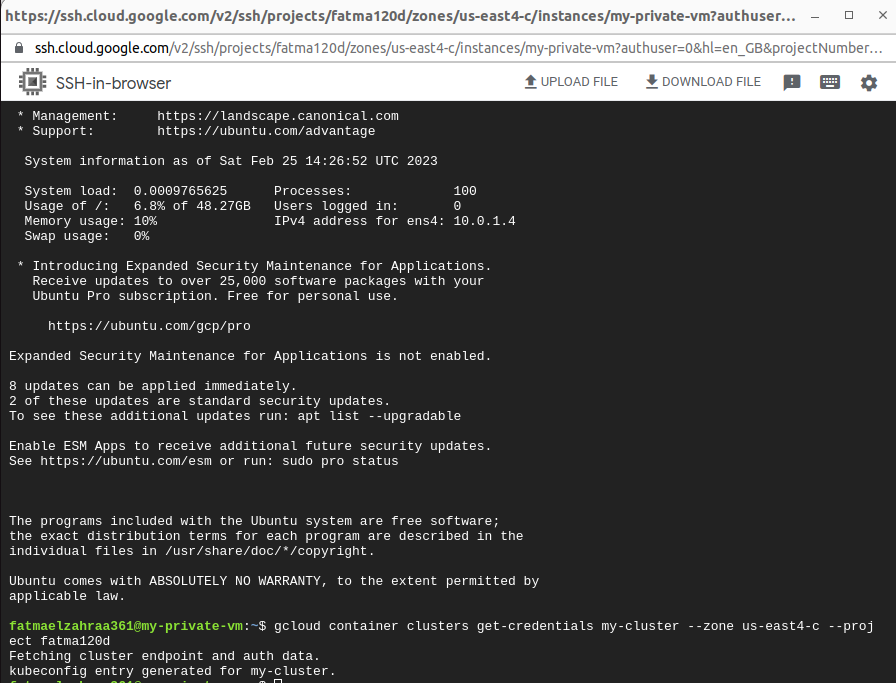
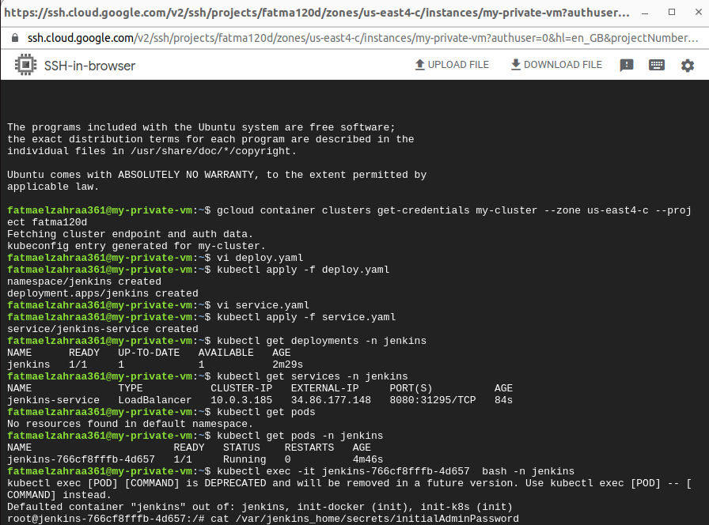
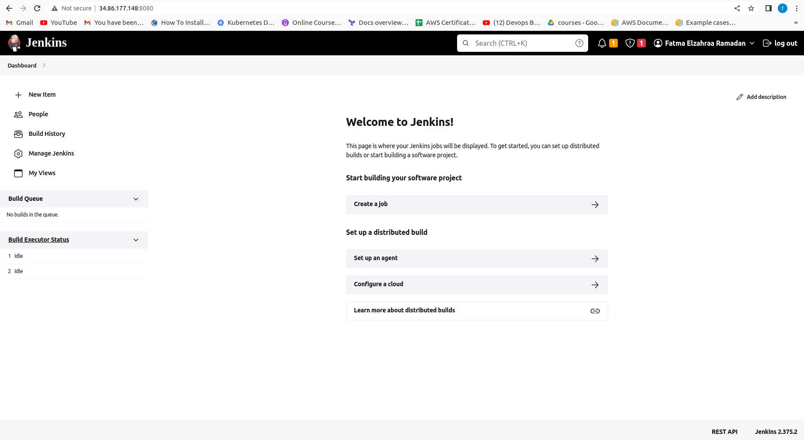

# DevOps-Infrastructure

## Implement and configure secure Kubernetes cluster on AWS/GCP using infrastructure as a code

### Create infrastructure and deployment process with terraform

$ terraform init
$ terraform plan
$ terraform apply

### SSH into VM and connect to private cluster

$ gcloud container clusters get-credentials my-cluster --zone us-east4-c --project fatma120d

## Deploy and Configure jenkins on the cluster and get load balancer external IP

## finally jenkins is Ready to use 

http://34.86.177.148:8080/

### click to the next link to go to the application
